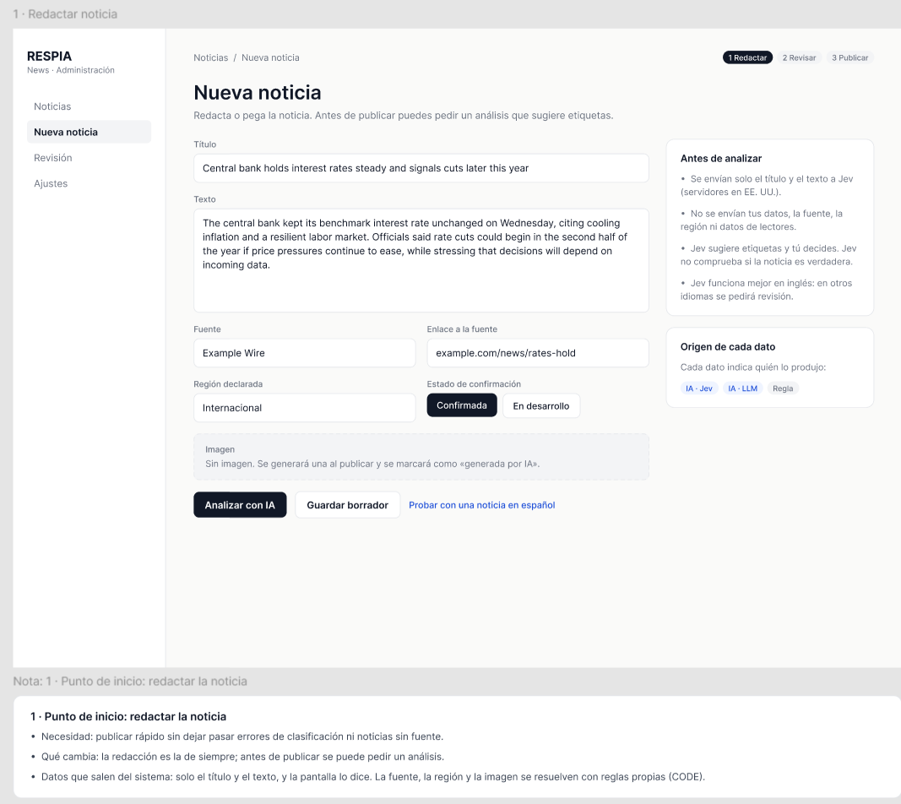
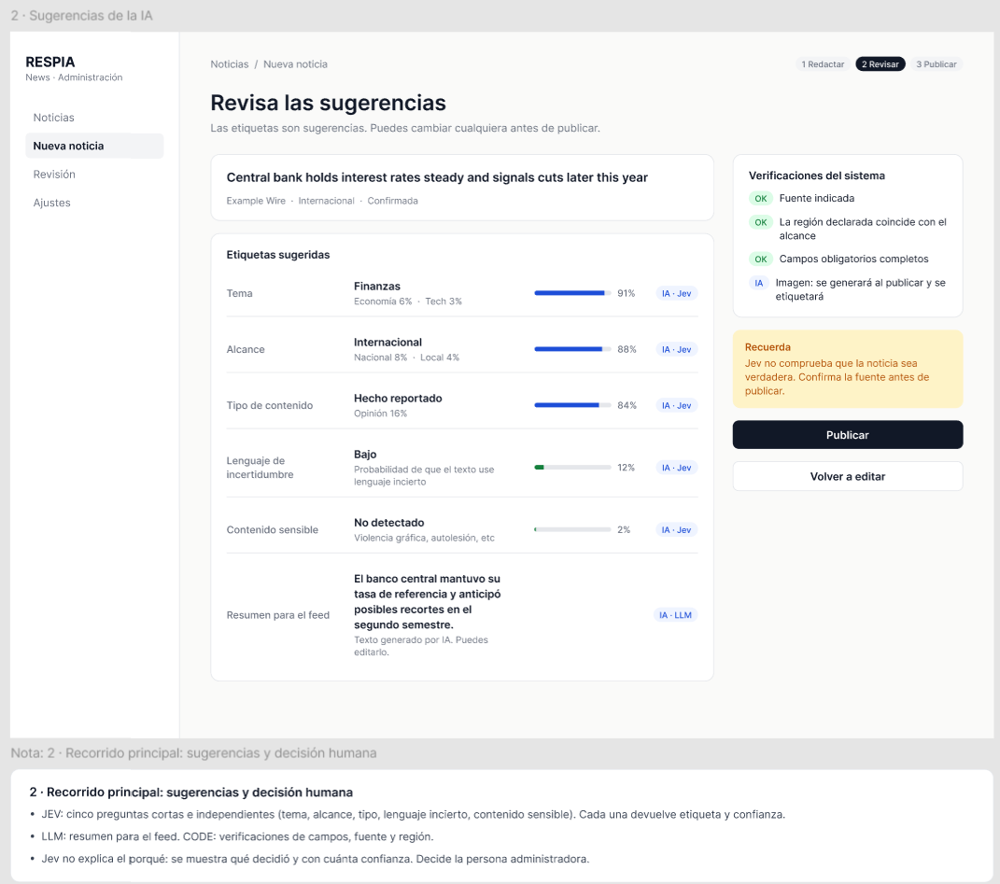
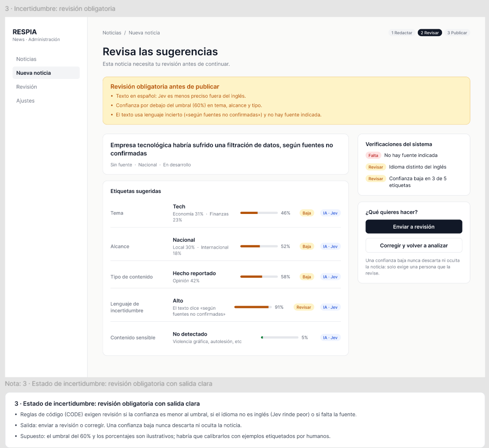
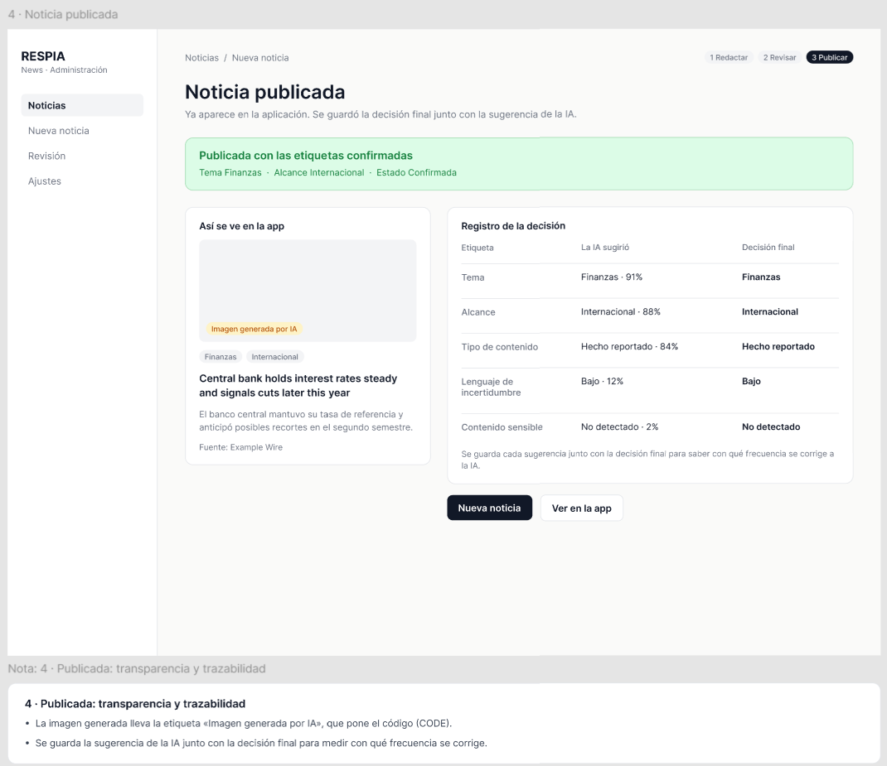
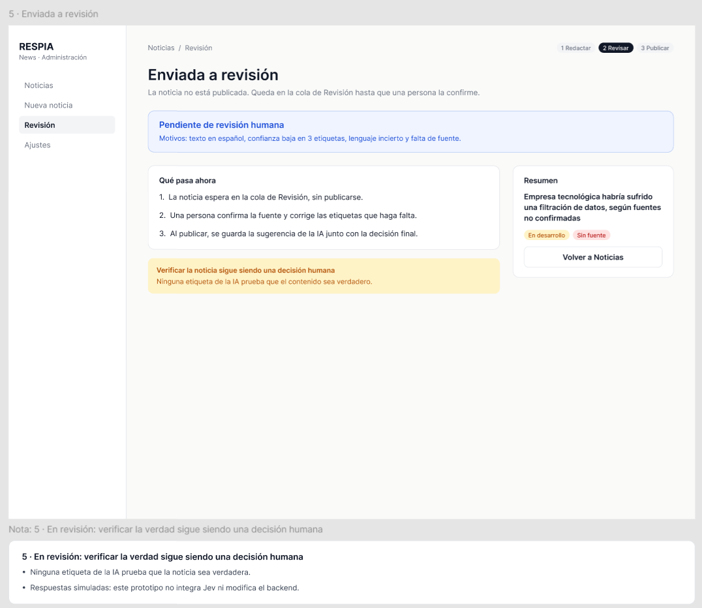

# Rediseño del Proyecto 2 con Jev

**Proyecto 2:** respia-news (AI Assisted News App)
**Integrantes:** Ricardo Chuy y Gerardo Pineda
**Flujo rediseñado:** publicación de una noticia desde el portal administrativo

**Prototipo interactivo (Figma, solo lectura):** https://www.figma.com/proto/Ys0JAn37SGCU98k0H5SwTL/RESPIA-News---Jev---Prototipo?node-id=3-2&p=f&t=ltaf9TOwnmfNuqby-1&scaling=min-zoom&content-scaling=fixed&page-id=0%3A1&starting-point-node-id=3%3A2
**Punto de inicio:** pantalla 1, «Redactar noticia». Pulsa «Analizar con IA» para el recorrido principal con la noticia en inglés. El enlace «Probar con una noticia en español» no forma parte del flujo real: es un atajo del prototipo para simular qué pasaría con **otra** noticia, en español y sin fuente, y mostrar el estado de incertidumbre. Las respuestas del prototipo son simuladas: no se integra Jev ni se modifica el backend.

**Marcas que usamos en los datos**

| Marca | Significa |
|---|---|
| **[V]** | Verificado en una fuente oficial de TypeSafe que leímos (documentación, DPA, MCA, política de privacidad) |
| **[T]** | Medición o afirmación de un tercero; leímos su artículo o repositorio original |
| **[R]** | Dato de un tercero que solo leímos en resumen |
| **[P]** | Afirmación del proveedor, sin verificación independiente |
| **[S]** | Supuesto nuestro |

---

## 1. El flujo actual y la necesidad

- **Flujo elegido y por qué:** el enunciado del Proyecto 2 pide que el admin registre la procedencia de cada noticia, que se pueda determinar su relevancia para distintos usuarios, que el sistema reduzca la publicación de noticias falsas y que comunique la incertidumbre. Elegimos la publicación y no el feed porque el feed llamaría a un modelo cada vez que alguien lo recarga; en la publicación hay una sola llamada por noticia y el resultado se guarda.
- **Persona:** la persona administradora que publica noticias. Secundaria: quien lee la noticia en la app.
- **Flujo actual [S]:** el enunciado no define el flujo. Suponemos que el admin escribe el texto y rellena a mano tema (Tech, Economía o Finanzas), región y procedencia, sin ayuda ni alertas antes de publicar.
- **Necesidad:** publicar con rapidez sin dejar pasar errores de clasificación, contenido sensible ni noticias sin fuente. Quien lee necesita noticias bien etiquetadas y que le digan cuándo algo es incierto.
- **Punto a mejorar:** el momento justo antes de publicar.

---

## 2. Lo que investigamos sobre Jev

### ¿Qué tareas puede resolver Jev y cuáles son sus límites frente a un LLM?

Jev es un modelo "System One" de TypeSafe: devuelve decisiones tipadas con probabilidades, no texto. Admite tres tipos de pregunta, combinables en una llamada [V]:
- `choice`: elige una opción (hasta 255), con distribución de probabilidades y confianza.
- `score`: puntúa en una rúbrica de 2 a 10 niveles.
- `noul`: probabilidad de que una afirmación sea cierta.

Encaja con decisiones pequeñas, cerradas e independientes: clasificar, enrutar, puntuar, filtrar y comprobar guardrails [V][T].

| Límite | Fuente |
|---|---|
| No genera texto: no resume, no explica, no redacta | [V] |
| Solo texto, hasta 64k tokens por solicitud | [V] |
| El inglés es el idioma de mejor precisión; en otros idiomas hay menos y piden probar antes | [V] |
| En español la precisión bajó de 3.0 a 6.4 puntos en cuatro benchmarks públicos, la calibración empeoró y el texto usa de 17% a 38% más tokens. Una sola corrida y no usa noticias | [T] auditoría `jev-acento` |
| "Lee literal", no da justificación auditable y no trata el texto de entrada como hostil | [T] guía de Valyu |
| Calibración desigual: sí/no subconfiado, `choice` y `score` sobreconfiados (en tickets de soporte, error de calibración 0.107) | [T] jev-phishing-bench, vía Beri |
| No puede abstenerse y "no es robusto ante contenido adversarial" | [R] Langfuse y Layer3Labs |
| No verifica si algo es verdadero en el mundo: solo analiza el texto recibido | [S] |

### ¿Qué datos enviaría el proyecto y qué dicen las políticas?

**Qué se enviaría [S]:** solo el título y el texto de la noticia. No se envían la identidad ni el correo del admin, datos de lectores, la fuente, la región ni la imagen.

| Tema | Qué dice | Fuente |
|---|---|---|
| Entrenamiento | No entrenan ni afinan modelos con las entradas del cliente | [V] política de privacidad |
| Compartir | No divulgan las entradas a terceros salvo proveedores de servicio | [V] política de privacidad |
| Telemetría | Recogen datos de uso, cookies y analítica; el MCA menciona "technical logs" | [V] política y MCA |
| Retención | "El tiempo razonablemente necesario", sin plazo fijo; retención cero solo para clientes enterprise | [V] política, DPA y página legal |
| Conservación y borrado | TypeSafe "no tiene obligación de almacenar ni retener" los datos y puede borrarlos a su discreción; no hay proceso de borrado a petición | [V] MCA, secc. 10.3 |
| Ubicación y transferencias | Servidores en EE. UU.; Cláusulas Contractuales Estándar de la UE | [V] política y DPA |
| Plazo y contenido de los logs | No se especifican | No especificado |

### ¿Qué evidencia hay sobre velocidad, costo y recursos?

"Recursos" lo medimos con lo observable al integrar el servicio: tokens consumidos, límites de tasa y de contexto, y el cómputo que queda en nuestro servidor. No hay datos sobre el consumo físico de los centros de datos.

| Dato | Valor | Fuente |
|---|---|---|
| Precio | $0.042 por millón de tokens de entrada; salida gratis | [V] |
| Límites | 80 solicitudes/s y 100K tokens/s | [V] |
| Latencia | 70 a 500 ms; un LLM tarda de 3 a 329 s | [P] el propio blog admite sesgo y que son el extremo alto |
| "40x a 200x más rápido y 193.6x más barato" | | [P] |
| Phishing, costo por 1,000 correos | Jev $0.038; Claude Haiku 4.5 $0.462 (una pregunta) | [T] |
| Phishing, exactitud con una pregunta | Jev 62.6% frente a 81.3% de Haiku | [T] |
| Phishing, cinco preguntas estrechas y regresión con 1,000 ejemplos etiquetados | Jev 95.0% frente a 93.2% de Haiku (no significativo). "El 95% no es Jev, es Jev más tus datos etiquetados más una regresión" | [T] |
| Costo para respia-news | ~$0.00004 por noticia con ~1,000 tokens (hasta 38% más en español) | [S] |

**Lo que nos dice para el diseño [S]:** las decisiones pequeñas rinden mejor que una pregunta amplia, los umbrales de confianza se calibran con ejemplos etiquetados por humanos, y por eso Jev solo sugiere y la persona decide.

---

## 3. Matriz por función: LLM / JEV / CODE

Los temas del portal son Tech, Economía y Finanzas. Las preguntas de JEV van en una sola llamada por noticia, así que comparten costo y velocidad.

| Función | Elección | Justificación | Impacto en UX | Privacidad | Velocidad | Costo | Recursos | Funcionalidad |
|---|---|---|---|---|---|---|---|---|
| Tema (Tech, Economía o Finanzas) | JEV | Elegir una categoría entre pocas | El admin parte de una sugerencia | Sale título y texto | 70 a 500 ms [P] | ~$0.00004 por noticia [S] | Tokens de entrada | Etiqueta con confianza |
| Alcance (local, nacional, internacional) | JEV | Clasificación de una frase | Menos errores de región; el código lo compara con la región declarada | Sale título y texto | Misma llamada | Misma llamada | Misma llamada | Etiqueta con confianza |
| Tipo: hecho reportado u opinión | JEV | Clasificación simple [S] | Aviso antes de publicar una opinión como hecho | Sale título y texto | Misma llamada | Misma llamada | Misma llamada | Etiqueta con confianza |
| Lenguaje incierto ("según fuentes no confirmadas") | JEV (`noul`) | Detecta señales en el texto; no sabe si algo está confirmado | Alerta, no veredicto | Sale título y texto | Misma llamada | Misma llamada | Misma llamada | Probabilidad de 0 a 1 |
| Contenido sensible (violencia gráfica, autolesión) | JEV (`noul` por tipo) | Guardrail rápido sobre el texto | Alerta; la decisión es humana | Sale título y texto | Misma llamada | Misma llamada | Misma llamada | Probabilidad de 0 a 1 |
| Estado de confirmación (confirmada o en desarrollo) | CODE | Es un campo que fija el admin | El lector ve la marca de incertidumbre | No sale nada | Inmediata | Sin costo | Servidor propio | Regla exacta |
| Verificar si la noticia es verdadera | Decisión humana | Ningún modelo debe tratarse como prueba (enunciado) | El admin debe confirmar la fuente | No sale nada | Tiempo de una persona | Tiempo de una persona | Una persona | Juicio y contraste de fuentes |
| Fuente presente, fuente nueva, campos vacíos | CODE | Reglas exactas | Impide publicar sin procedencia | No sale nada | Inmediata | Sin costo | Servidor propio | Regla exacta |
| Umbrales de confianza y ruta a revisión | CODE | Regla simple y auditable | El admin ve el motivo del aviso | No sale nada | Inmediata | Sin costo | Servidor propio | Regla exacta |
| Resumen para el feed | LLM | Es generación de texto | Texto breve y legible | Sale el texto al proveedor del LLM (por definir) [S] | De 3 a 329 s [P] | Tokens de entrada y de salida [P] | Muchos tokens de salida | Genera texto |
| Imagen cuando falta | LLM (modelo generativo de imágenes, distinto de Jev) | Jev no ve ni genera imágenes | Imagen etiquetada "generada por IA", que pone el código | Sale un prompt al proveedor (por definir) [S] | Segundos [S] | Por imagen [S] | Cómputo del proveedor | Genera imágenes |
| Chat de noticias con fuentes (fuera del flujo elegido) | LLM | Requiere generar explicaciones | Sin cambios | Sale la consulta y el contexto (por definir) [S] | De 3 a 329 s [P] | Tokens de entrada y de salida [P] | Muchos tokens de salida | Genera texto con fuentes |

**Comparación general**

| Criterio | LLM generalista | Jev | Código |
|---|---|---|---|
| Velocidad | De 3 a 329 s [P] | De 70 a 500 ms [P] | Inmediata |
| Costo | $0.20 a $10 por millón de tokens de entrada, salida más cara [P] | $0.042 por millón, salida gratis [V] | Sin costo por llamada |
| Qué se gana | Flexibilidad | Velocidad, costo y una confianza numérica | Previsibilidad y auditabilidad |
| Qué se pierde | Costo y latencia | Texto libre, justificaciones y precisión en español [T] | No entiende lenguaje natural |

---

## 4. El flujo propuesto

1. El admin escribe o pega la noticia y completa fuente y región.
2. El código valida campos obligatorios, fuente, región y longitud.
3. El sistema envía a Jev solo el título y el texto, con preguntas cortas e independientes: tema, alcance, tipo, lenguaje incierto y contenido sensible. Si falta imagen, aparte, se pide una a un modelo generativo.
4. El código aplica los umbrales de confianza y decide si hace falta revisión.
5. El admin ve las sugerencias con su confianza y las alertas, corrige y publica.
6. Se guardan las etiquetas finales y la sugerencia de la IA.

**Datos que salen del sistema:** título y texto de la noticia hacia Jev. Para el resumen y la imagen, hacia los proveedores que se elijan (por definir).

### Medidas de Responsible AI

- **Datos mínimos:** solo título y texto. Nada de datos del admin ni de lectores.
- **Límites e incertidumbre a la vista:** cada sugerencia muestra su confianza y su origen (IA · Jev, IA · LLM o Regla). Las alertas dicen qué detectó el modelo, no si la noticia es verdadera. El estado de confirmación sale de un campo del admin, no de Jev.
- **Si la decisión es incorrecta:** el admin puede cambiar cualquier etiqueta antes de publicar y corregirla después. Se guarda la sugerencia junto con la decisión final para saber con qué frecuencia se corrige a la IA.
- **Riesgo de sesgo o exclusión:** Jev rinde mejor en inglés [V] y en español baja la precisión y empeora la calibración [T]. Una noticia en español, local o de una región poco representada podría recibir una etiqueta peor y quedar oculta justo donde el enunciado pide no ocultar información local. **Medida:** si el idioma no es inglés, la confianza es baja o falta la fuente, la revisión humana es obligatoria, y ninguna noticia se descarta ni se degrada por la clasificación.
- **Contenido pegado:** un texto externo podría traer instrucciones que desvíen la clasificación [T]. La decisión final siempre es de una persona.
- **Sin justificación:** Jev no explica sus decisiones [T]. Mostramos qué decidió y con qué confianza.

---

## 5. El prototipo

Cinco pantallas. Un recorrido principal (1, 2, 4) con una noticia en inglés, y un estado de incertidumbre con salida clara (1, 3, 5). **Las pantallas 3 y 5 muestran otra noticia**, escrita en español y sin fuente, que se alcanza con el atajo «Probar con una noticia en español» de la pantalla 1. Sirve para simular qué podría pasar con una noticia en español; no es la misma noticia de las pantallas 1, 2 y 4. Los porcentajes y el umbral de 60% son ilustrativos. Cada pantalla trae su anotación en el archivo de Figma.

| # | Pantalla | Qué muestra |
|---|---|---|
| 1 | Redactar noticia (inicio) | El flujo de siempre, con aviso de que solo salen el título y el texto. Incluye el atajo para simular una noticia en español |
| 2 | Sugerencias de la IA | Noticia en inglés. Tema, alcance, tipo, lenguaje incierto y contenido sensible con su confianza y origen; verificaciones del sistema; recordatorio de que Jev no verifica la verdad |
| 3 | Incertidumbre: revisión obligatoria | Simulación con otra noticia, en español y sin fuente: confianza baja y alertas; salidas: enviar a revisión o corregir |
| 4 | Noticia publicada | Continúa la noticia en inglés: imagen etiquetada como generada por IA y registro de lo que sugirió la IA frente a la decisión final |
| 5 | Enviada a revisión | Continúa la noticia en español de la pantalla 3: queda sin publicar; verificar la verdad sigue siendo humano |

---

## 6. Conclusión sobre la arquitectura propuesta

Un sistema híbrido: **Jev** resuelve las decisiones cortas y cerradas de clasificación y alerta al publicar, el **código** aplica reglas exactas, umbrales y validaciones, y un **LLM** genera lo que necesita texto libre (resúmenes y chat), junto con un modelo de imágenes. Verificar la verdad y decidir publicar siguen siendo de una persona.

Lo que se gana, según las fuentes: llamadas más rápidas y baratas en las decisiones pequeñas [P][T] y datos mínimos enviados al proveedor. Lo que queda en riesgo: no hay justificaciones, el español tiene menor precisión [T] y la confianza hay que calibrarla [T].

### Supuestos y lo que faltaría verificar

Es un caso hipotético: no se implementa nada, así que lo siguiente se declara y no se verifica.
- Que Jev clasifique bien noticias reales; las pruebas de terceros son de otras tareas.
- Que los umbrales de confianza (el prototipo usa 60%) se calibren con ejemplos etiquetados por humanos. Los porcentajes del prototipo son ilustrativos.
- Que las noticias se clasifiquen en inglés o se traduzcan antes, y cuánto cuesta traducir. Cómo se detecta el idioma no está definido.
- Que el DPA cubra a quien use créditos de bienvenida.
- Plazo y contenido de los logs, y lista de subprocesadores: no se especifican en los documentos que leímos.
- Los datos marcados [P] y [R] vienen del proveedor o de resúmenes de terceros y no se verificaron en el original.

---

## Fuentes

**Del proveedor (leídas):**
- Documentación de Jev: https://docs.typesafe.ai/introduction
- Modelos: https://docs.typesafe.ai/models.md
- API: https://docs.typesafe.ai/api.md
- Blog de presentación: https://typesafe.ai/blog/introducing-system-one-models-and-jev
- Data Processing Agreement: https://typesafe.ai/legal/data-processing
- Master Customer Agreement: https://typesafe.ai/legal/mca
- Política de privacidad: https://typesafe.ai/privacy

**De terceros, leídas en el original:**
- Guía de Valyu: https://dev.to/valyuai/how-to-use-jev-a-practical-guide-to-typesafes-system-one-model-g5e
- Auditoría en español `jev-acento`: https://github.com/marcosmartinez/jev-acento
- jev-phishing-bench, artículo de Rajesh Beri: https://www.beri.net/article/typesafe-jev-typed-decision-model-calibration-decomposition-shadow-eval

**De terceros, solo en resumen:**
- Layer3Labs: https://www.layer3labs.io/guides/jev-benchmarks
- Langfuse: https://langfuse.com/blog/2026-09-18-using-typesafes-jev-for-evals.md
- DataCamp: https://www.datacamp.com/blog/system-one-models-jev
